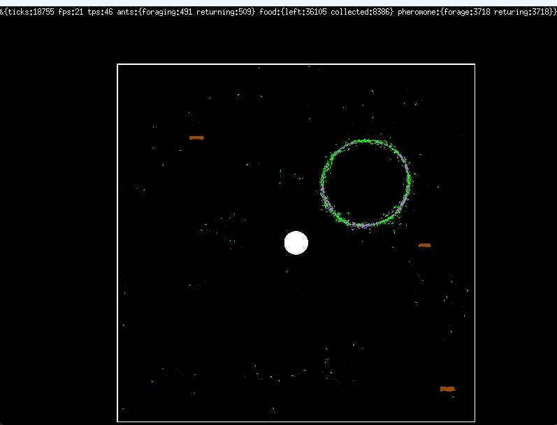
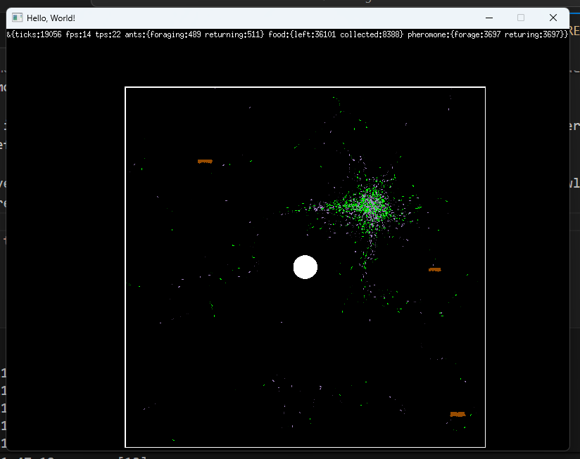

other sims
- https://openprocessing.org/sketch/15109/
- https://www.reddit.com/r/rust/comments/15dp0hq/media_ant_colony_simulation_in_rust_and_bevy/
  - https://github.com/bones-ai/rust-ants-colony-simulation

go tool pprof cpu.prof
go tool pprof -dot cpu.prof > cpu.dot
go tool pprof -dot mem.prof > mem.dot

depending on params, seeing 1 of 2 familiar problems
- either, the ants don't care enough about the path, and they wander forever
- or, they care too much and follow each other in circles 

I think:
- wider search radius would help, along with stronger weighting for closer and angular similarity
- maybe back to kd tree for pheromone, but less much less density, e.g. only deposit every N frames
  - this combined with large radius might still be effective?
  - thinking about this sim: https://www.reddit.com/r/rust/comments/15dp0hq/media_ant_colony_simulation_in_rust_and_bevy/

things working well now, need a lot of perf work though
- some in rendering, some in management of kdtrees

big finds:
- larger search radius matters a lot
- weighting signals based on distance, cosine similarity

perf opportunities
- less frequent sensing, more influence

apparently drawing food as circles was incredibly expensive... how did I miss this with pprof?

anti-aliasing was also very expensive, not needed
- oh... like very very expensive...

next steps
- should we keep turning around on state change? or allow sensing of pheromone behind

trying to abstract away kdtree so we can plug and play
- different kd tree impls
- different spatial datastructures

ok so spatial hashing is awesome...
things are a bit tangled now though, would like to remove kdtree.Point everything except kd wrapper implementation

after a few minutes, the "gym" produced:
params := Params{AntSpeed: 4.004083786014876, AntRotation: 19.577112276772198, PheromoneSenseRadius: 145.02980311888592, PheromoneDecay: 0.0359234, PheromoneDropProb: 0.278618588611103, PheromoneInfluence: 6.8941542247347485, PheromoneSenseProb: 0.46472625874412476}

which is super interesting... fast ants, pheromone decays very fast. Ants converge quickly, and then break out and scatter for before repeating.

Observed a few times that they would form a ring of mostly the same state, slowly tighten, and then explode outward when they reached the center

which was then beaten minutes later by 
{AntSpeed:1.1074422968310311 AntRotation:1.5449212668986223 PheromoneSenseRadius:144.77348189322214 PheromoneDecay:0.05122324 PheromoneDropProb:0.2518914151215831 PheromoneInfluence:2.600420296690782 PheromoneSenseProb:0.26713126919182}

with very slow ants, with fairly conservative pheromone sensing.

There probably is a big luck element here, maybe it would make sense to take the median of N samples as the score for each iteration